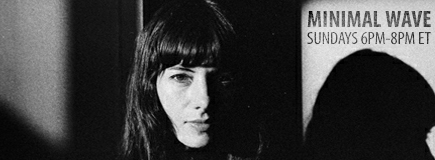

# minimalwave

Play a random set from Minimal Wave (EVR, 70/80, synth, wave) from [Minimal
Wave](https://archive.org/details/eastvillageradio-minimal-wave?tab=collection)
collection.

> [Veronica Vasicka](https://en.wikipedia.org/wiki/Veronica_Vasicka) has been
> hosting her EVR show since 2003. She explores a range of electronic music
> from the 70s till now featuring gems she discovers for her [Minimal
> Wave](https://minimalwave.com/) record label. Sundays 6 - 8 PM ET

To install:

```
$ go install github.com/miku/minimalwave@latest
```



Usage:

```
$ minimalwave
```


