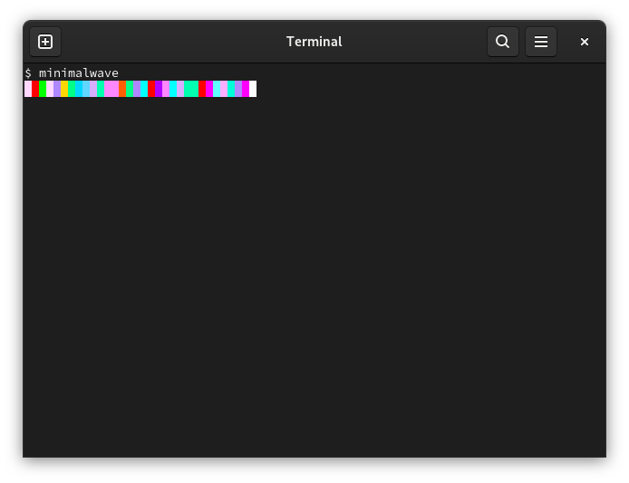

# minimalwave

Play a random set from [Minimal
Wave](https://archive.org/details/eastvillageradio-minimal-wave?tab=collection)
([EVR](https://en.wikipedia.org/wiki/East_Village_Radio), 70s/80s, synth, wave)
collection. It will use an available headless terminal player - so it will feel
a bit like radio, as you will not be to rewind or fast forward.

> [Veronica Vasicka](https://en.wikipedia.org/wiki/Veronica_Vasicka) has been
> hosting her EVR show since 2003. She explores a range of electronic music
> from the 70s till now featuring gems she discovers for her [Minimal
> Wave](https://minimalwave.com/) record label. Sundays 6 - 8 PM ET

To install:

```
$ go install github.com/miku/minimalwave@latest
```

[](https://archive.org/details/eastvillageradio-minimal-wave?tab=collection)

Usage:

```
$ minimalwave
```



Files will be cached in
[XDG](https://wiki.archlinux.org/title/XDG_Base_Directory) cache home, e.g.
`~/.cache/minimalwave/` or the like.
